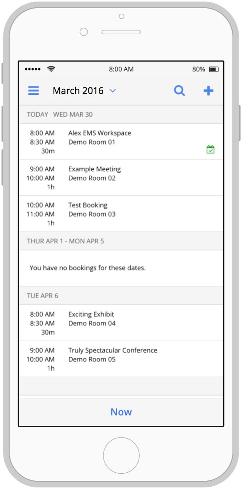
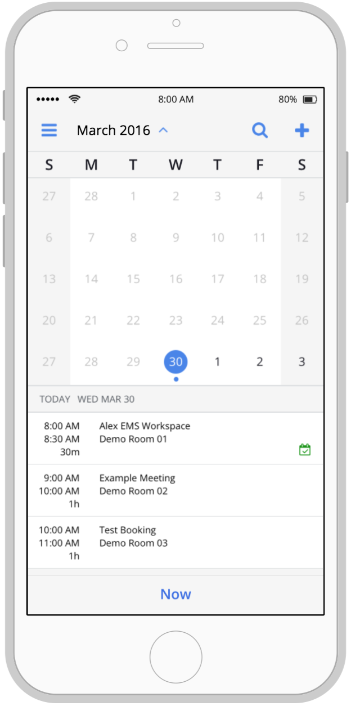

# Chores (Items left):
1. Make the 'Add New Booking' button actionable
    - Currently the page is there but it does not add the item to the list

# Requirements

## Tasks

1. Clone this repository or make your own.
1. Implement the use cases below using [React](https://facebook.github.io/react/) to build a a small web application.
    - Use the images to guide the visual design of your implementation.
    - There is a `bookings.json` file in the `prototype` directory of this repository that you may use for your initial data.  Feel free to create more.
1. Send a zip file of your repository to your contact at EMS.

### Tips

- If you are familiar with [Redux](http://redux.js.org/), feel free to incorporate it in your solution.  This applies to any other react sister libraries you may prefer to use as well.
- Focus on your approach to the problem, the structure and reasoning behind your implementation, and the quality of your code.  Fewer features implemented at higher quality is of more value than missing the mark by focusing too much on visual details.

## Prototype Use Cases

The images below represent a prototype for a mobile application that displays to a user a list of her bookings in chronological order.  Following are use cases intended for this simple application.

### 1. Navigating By Calendar Selection

1. The user taps on the month-year header (or the blue arrow next to it) in the navigation bar and a calendar appears.
1. The list of bookings scrolls to the date selected by the user in the calendar.
1. The user taps again on the month-year header and the calendar collapses. 

### 2. Searching Bookings

1. The user taps the magnifying glass in the navigation bar.
1. The navigation bar is replaced with a search interface not unlike those found here: [Search Bars](https://developer.apple.com/ios/human-interface-guidelines/ui-bars/search-bars/)
1. Typing into the search bar filters the list of bookings.  Those that remain are those that match the search text either in the name of the booking or in the name of the room where the booking is located.
1. The user may dismiss the search interface at any time and the previous state of the application will return.

### 3. Now

1. The user scrolls the bookings list so that today's bookings no longer appear at the top of the list.
1. The user taps the `Now` button at the bottom of the screen so that the user's current or next booking appears at the top of the list.

### 4. The Plus Icon

1. The user taps the plus icon in the navigation bar
2. The user is prompted for:
    - A name for the booking
    - A room for the booking (this may be free text)
    - A start time
    - An end time
3. The user's input is used to create a booking, and the list of bookings updates to display that booking.

## List View

## With Calendar Open

